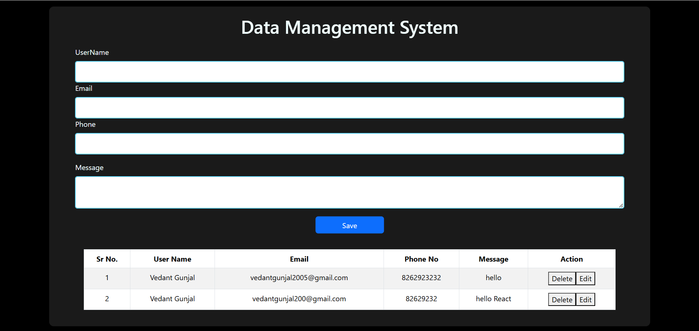

# Data Management System 📝

A simple **React.js** application for managing user data, including adding, updating, and deleting records in a table.

## 🚀 Features
- Add new users with **name, email, phone number, and message**.
- Prevents duplicate **email or phone number** entries.
- Edit existing user details.
- Delete users from the table.
- Displays success/error messages using **React Toastify**.
- Uses **Bootstrap** for styling.

## 📸 Screenshot

## 📸 Video
📽️ [Watch the Video](Output/video.mp4)

## 🛠️ Technologies Used
- **React.js** (with Hooks)
- **Bootstrap** (for styling)
- **React-Bootstrap** (components)
- **React Toastify** (notifications)

## usage
1.Fill in the user details in the form.
2.Click the Save button to add a new user.
3.Click Edit to update user details.
4.Click Delete to remove a user.
